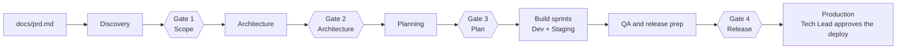

# Code-invention AI Delivery Team: Claude Code template

A team of 10 Claude Code agents that takes a PRD to a released product.
Agents write the requirements, architecture, plan, code, tests and docs. A human **Tech Lead** supervises: they approve four gates, review the work at each gate, and are the only one who can release to production.

Rolling the template out at Code-invention? Follow **[IMPLEMENTATION_PLAN.md](IMPLEMENTATION_PLAN.md)**.

## How a project runs



- At the end of each phase, the Orchestrator writes a one-page **gate pack** to `project/decisions/gate-<n>.md` and stops.
- Work continues only after the Tech Lead runs `/gate <n> approve`. `/gate <n> reject <notes>` sends the notes back to the agent that did the work.
- **PoC mode** (`mode: poc`, at most one week) merges Gates 1–3 into one kickoff approval (`/gate kickoff approve`) and runs smoke tests only.

## Who does what

| Tech Lead (human) | Agents |
| --- | --- |
| Writes the PRD in `docs/prd.md` | Turn the PRD into stories, architecture, a plan and tickets in `docs/backlog/` |
| Runs `/setup-project` and answers its questions | Implement tasks, open PRs, review each other's PRs, fix findings |
| Answers open questions; approves or rejects each gate | Run CI, deploy to Dev on every merge and to Staging daily |
| Merges release PRs from `development` into `main` | Test against acceptance criteria, file bugs, write the docs |
| Approves the production deploy in GitHub | Track token usage and pause at 80% of the budget |

Only the Orchestrator talks to the Tech Lead. The other agents hand work to each other through files and work items.

## Start a new project

1. Create the repo from the template, and the `development` branch (new repos copy only `main`):
   ```bash
   gh repo create <owner>/<name> --template mendimci/ai-agents-development-team-template --private --clone
   cd <name> && git checkout -b development && git push -u origin development
   ```
2. Install the Claude GitHub App on the repo, then run `claude setup-token` and `gh secret set CLAUDE_CODE_OAUTH_TOKEN` (paste the token at the prompt). Before the first deploy, also set `PORTAINER_DEV_WEBHOOK` and `PORTAINER_STAGING_WEBHOOK`.
3. Copy [templates/prd-template.md](templates/prd-template.md) to `docs/prd.md`, fill it in, and commit it.
4. Open the folder in VS Code and, in the Claude panel, run `/setup-project`. It removes the template-only files and writes a project README in place of this one, asks about tools, environments and budget, checks every connection, and commits `project/project.yaml`.
5. Run `/kickoff`, then follow the gates.

Nothing external is needed to start: the PRD, tickets, board and decisions are all files in the repo.

## Commands

| Command | Run by | When | What happens |
| --- | --- | --- | --- |
| `/setup-project [area]` | Tech Lead | Once at the start; again to change one area (e.g. `tracker`) | Interviews you, writes and validates `project/project.yaml`, prints a pass/fail connection table |
| `/kickoff` | Tech Lead | After setup | Reads `docs/prd.md`, runs Discovery, prepares Gate 1 (PoC: also Architecture and Planning, then one kickoff gate) |
| `/gate <n> approve\|reject [notes]` | Tech Lead only | After reading a gate pack | Records the decision, marks that gate's ADRs accepted, starts the next phase or routes the notes back |
| `/sprint [n]` | Tech Lead | After Gate 3, repeatedly | Picks up to `n` ready tasks (default 2), builds them in parallel worktrees, reviews, merges into `development` |
| `/qa [dev\|staging]` | Tech Lead | Once features reach Dev, and before release | Runs against Staging unless `dev` is given: integration and E2E tests, files bugs, updates `docs/qa-report.md` |
| `/release` | Tech Lead | When QA passes | Final QA, SBOM report, runbook and docs, then the Gate 4 pack |
| `/status` | Anyone | Any time | Phase, gates, work items by state, last deploys, token usage, decisions waiting |

## Agents

| Agent | Model | Phase | Produces |
| --- | --- | --- | --- |
| orchestrator | Opus | All | Decides who works next, writes gate packs, tracks budget, talks to the Tech Lead |
| product-analyst | Opus | Discovery | `docs/open-questions.md`, `docs/requirements.md`, epics and stories in the tracker |
| solution-architect | Opus | Architecture | `docs/architecture.md`, ADRs, `docs/api/openapi.yaml`, hosting and token cost estimate |
| planner | Opus | Planning | Tasks sized to one PR each, `docs/plan.md` |
| backend-engineer | Sonnet | Build | APIs, services, data layer, tests, PR |
| frontend-engineer | Sonnet | Build | Accessible UI (WCAG 2.1 AA), component tests, PR |
| devops-engineer | Sonnet | Build | CI/CD, Dockerfile, infrastructure as code, deploys, `docs/runbook.md` |
| code-reviewer | Opus | Every PR | APPROVE or REQUEST_CHANGES with findings; `docs/sbom-report.md` at release |
| qa-engineer | Sonnet | QA | `docs/test-plan.md`, E2E tests, bugs, `docs/qa-report.md` |
| tech-writer | Haiku | End of each sprint, release | README, API docs, user guide, `docs/handover.md` |

Agents never call Jira, Azure DevOps or GitHub directly. They use the neutral skills `work-tracker`, `code-host` and `deploy`, which read `project.yaml` and pick the right adapter. Changing a project's tracker is a config change, not a prompt change.

## Backlog and board

By default (`tools.tracker.provider: markdown`) tickets live in the repo:

- `docs/backlog/items/<KEY>.md`: one file per epic, story, task or bug. Its front matter holds the type, title, status, parent, labels, estimate and PR link, and the body holds the description, acceptance criteria and a dated log.
- `docs/backlog.md`: the board. It lists epics with their progress, then tickets grouped by status (in progress, in review, ready, backlog, done). It's generated, so never edit it by hand.

Agents change tickets with `node scripts/backlog.mjs` (`new`, `move`, `set`, `comment`, `list`, `delete`, `rekey`, `render`), inside the same PR as the work. You can do the same, or edit a ticket file and run `node scripts/backlog.mjs render`. CI fails when the board doesn't match the ticket files.

**Later: Jira, Azure DevOps or Notion.** The adapters are ready, but each project enables them only after the Tech Lead confirms. Run `/setup-project tracker` (or `docs`): it copies the MCP server from `.mcp.integrations.example.json`, connects it, and maps the states.

## Branches and environments

| Branch | Gets code from | Deploys to |
| --- | --- | --- |
| `<type>/<ticket>-<slug>` | One task, one PR | — |
| `development` | Task PRs, after CI and agent review | **Dev**, on every merge |
| `main` | Release PRs, merged by the Tech Lead | **Staging**, each weekday at 05:00 UTC or on demand; **Production**, manually |

Production runs only through the `deploy-prod` workflow. It checks that Gate 4 is approved and waits for the Tech Lead's approval in the GitHub `production` environment.

## Quality and safety guardrails

- **Every PR:** CI must be green: `validate-project`, `build-test`, and `sbom` (no critical CVEs, no GPL-3.0, AGPL-3.0 or SSPL licences). The code-reviewer agent must approve. It runs during `/sprint`, and again on GitHub for every non-draft PR through `claude.yml`.
- **Standards** in [CLAUDE.md](CLAUDE.md):
  - preferred stacks, standard linters, sparse comments
  - 80% coverage on changed lines; unit, integration, E2E and contract tests
  - OWASP Top 10, GDPR, WCAG 2.1 AA, and the docs every project must have
- **Hooks and permissions** in `.claude/`:
  - a shell hook blocks force-pushes, production deploys and destructive commands
  - a write hook refuses file content that looks like a secret (cloud keys, tokens, private keys)
  - permission rules stop agents reading `.env` files and `secrets/` folders
- **Escalation:** an agent that is stuck after 3 attempts stops and escalates to the Tech Lead through the Orchestrator.

## Cost

Agents in VS Code and the Claude PR review in GitHub Actions both run on your Claude subscription (`CLAUDE_CODE_OAUTH_TOKEN`), so there is no separate API bill. The budget in `project.yaml` works as a usage guardrail: `token_cap_percent` of the project budget, or `token_cap_usd` when set (it wins). The Orchestrator pauses at `pause_at_percent` of the cap (default 80%) and asks the Tech Lead. Use `/cost` to see a session's usage at API prices.

## What's in the repo

| Path | Purpose |
| --- | --- |
| `CLAUDE.md` | Team rules: gates, engineering standards, safety, cost |
| `.claude/agents/`, `.claude/commands/`, `.claude/skills/` | The agents, slash commands, and neutral and know-how skills |
| `.claude/hooks/`, `.claude/settings.json` | Safety hooks and permission rules |
| `.mcp.json`, `.mcp.integrations.example.json` | No MCP servers by default; Jira, Notion, GitHub and Azure DevOps servers ready to copy in when an integration is enabled |
| `project/` | `project.yaml` (per project), its schema and example, and `decisions/` for gate packs and ADRs |
| `templates/` | PRD, gate pack and ADR templates |
| `.github/workflows/` | `ci`, `deploy-dev`, `promote-staging`, `deploy-prod`, `claude` (PR review) |
| `scripts/` | Backlog CLI, `project.yaml` validator, licence check, config reader, health check |
| `docs/` | `prd.md` (Tech Lead), the backlog and board, and project docs written by the agents; `metrics.md` logs Tech Lead interventions |

## Maintaining this template

- Change the template like any project: a feature branch, a PR into `development`, then a release PR into `main`. New projects copy only `main`.
- `IMPLEMENTATION_PLAN.md` and this README are template-only. They're listed in `.template-only`: `/setup-project` deletes the plan from new projects and replaces this README with a project README.
- Improvements found while running a project come back here as PRs. GitHub copies a template only once, so existing projects pull updates in themselves, on a branch with a PR to their `development`:
  ```bash
  git remote add template https://github.com/mendimci/ai-agents-development-team-template.git
  git fetch template && git merge template/main --allow-unrelated-histories
  ```
  `--allow-unrelated-histories` is needed only the first time. When resolving conflicts, keep the project's own README and `project.yaml`, and keep the template-only files deleted.
