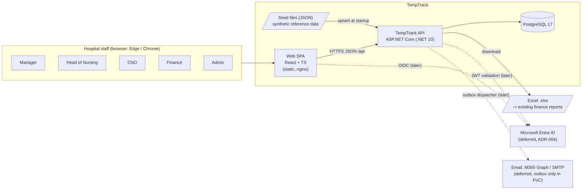
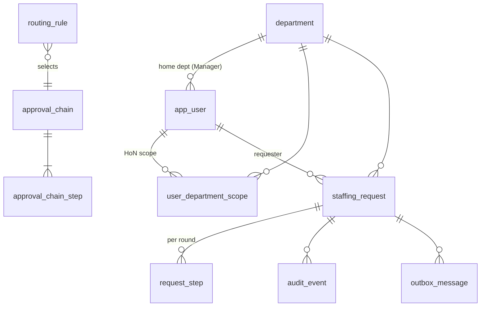
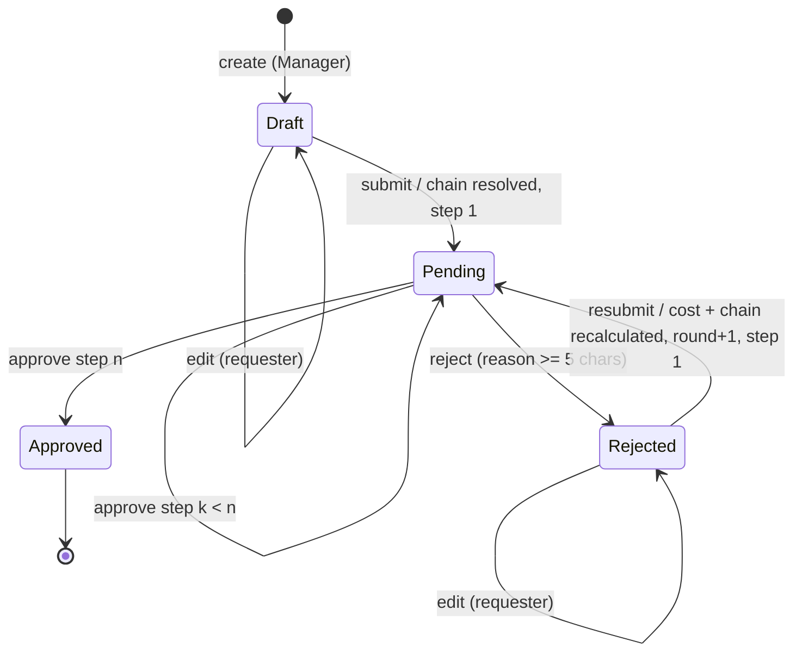
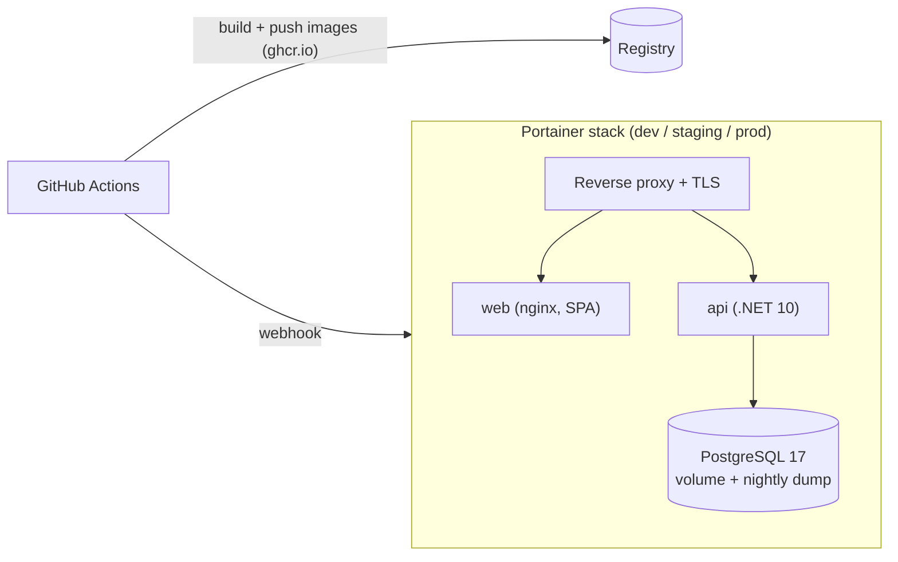

# TempTrack: Architecture (PoC)

Status: **proposed** for the PoC kickoff gate (Gates 1-3 merged, `mode: poc`). Date: 2026-10-06.
Inputs: `docs/prd.md`, `docs/requirements.md`, `project/project.yaml`. Decisions: ADR-001 to ADR-006 in `project/decisions/`.

## 1. Summary

| Concern | Decision | ADR |
| --- | --- | --- |
| Backend | .NET 10 (LTS), ASP.NET Core minimal APIs, EF Core 10 | [ADR-001](../project/decisions/adr-001-stack.md) |
| Frontend | React 19 + TypeScript, Vite, React Router, TanStack Query, typed client generated from OpenAPI | [ADR-001](../project/decisions/adr-001-stack.md) |
| Hosting | PoC: local `docker compose`. Later: Docker images on the company Portainer (dev/staging/prod), portable to Azure | [ADR-002](../project/decisions/adr-002-hosting.md) |
| Data store | PostgreSQL 17 (container locally; managed or containerised later) | [ADR-003](../project/decisions/adr-003-data-store.md) |
| Auth | Pluggable: flag-guarded mock "dev user" scheme now; Entra ID (Microsoft.Identity.Web + MSAL) later, same authorisation code | [ADR-004](../project/decisions/adr-004-auth.md) |
| Excel export | ClosedXML (MIT), SixLabors.Fonts pinned to 1.x (Apache-2.0) | [ADR-005](../project/decisions/adr-005-excel-export.md) |
| Approval workflow | Data-driven routing rules and chains from seed files; hand-written state machine in the domain, no workflow engine | [ADR-006](../project/decisions/adr-006-approval-workflow-config.md) |

Shape: **one API service, one database, one static SPA**. No queues, caches or background workers in the PoC.

## 2. Context



Integration points:

| Integration | PoC | Later (full build) |
| --- | --- | --- |
| Identity (Entra ID) | None; mock dev-user scheme | OIDC in SPA (MSAL), JWT bearer validation in API, app roles |
| Email | Outbox table only, nothing sent | Dispatcher reads outbox, sends via Microsoft Graph or SMTP relay (Q14), retries |
| Finance reporting | `.xlsx` download | Client templates and export scenarios (Q15) |
| Monitoring | stdout JSON logs, `/health` | Ship logs/OTel to client monitoring (PRD 8.1) |

## 3. Components and responsibilities

| Component | Responsibility |
| --- | --- |
| **Web SPA** (`src/web`) | Pages: sign-in (mock user picker), My requests, Request form (live cost), Request detail (chain, audit), Approvals queue, Export, Outbox (Admin). Holds no business rules beyond input hints; server is authoritative. Reads runtime `/config.json` (API URL, auth mode) so one image serves every environment. |
| **API: Endpoints** (`Features/*`) | Thin minimal-API handlers: bind, validate at the boundary, call a feature service, map results to HTTP / ProblemDetails (RFC 9457). |
| **API: Domain** (`Domain/`) | Pure C#, no EF or HTTP: `StaffingRequest` aggregate and its state machine, `CostCalculator`, `RoutingPolicy`, `VisibilityPolicy`. Unit-testable with an injected `TimeProvider`. |
| **API: Feature services** | One per feature (Requests, Approvals, Audit, Outbox, Export, Reference). Orchestrate a use case in **one DB transaction**: load, authorise, apply domain transition, append audit event, append outbox message, save. |
| **API: Infrastructure** | `TempTrackDbContext` + repositories, EF migrations, seed loader, ClosedXML writer, auth handlers, correlation-ID middleware. |
| **PostgreSQL** | Single database `temptrack`. Holds reference data, requests, step instances, audit events, outbox. |

## 4. Data model

Conventions: `uuid` ids (except `audit_event` and `outbox_message`: `bigint identity`, ordered), snake_case tables,
all instants `timestamptz` in UTC, money `numeric` (never float), enums stored as text.



**Reference data (seeded, upserted by natural key)**

| Entity | Key fields |
| --- | --- |
| `department` | id, code (natural key), name, directorate |
| `app_user` | id, external_id (Entra `oid`, null in PoC), display_name, email, role (`Manager`, `HeadOfNursing`, `CNO`, `Finance`, `Admin`), home_department_id (Managers), is_synthetic |
| `user_department_scope` | user_id, department_id (Head of Nursing scope) |
| `pay_rate` | id, staff_type (`Overtime`, `Bank`, `Agency`), band, hourly_rate `numeric(10,2)`, currency `GBP`; unique (staff_type, band) |
| `reason_code` | code, label (sickness, vacancy, increased acuity, annual leave, other) |
| `approval_chain` | id, code (`standard`, `extended`), name |
| `approval_chain_step` | chain_id, step_order, role, label (e.g. "Agency approval") |
| `routing_rule` | priority, match_staff_type (nullable), match_min_cost (nullable, `numeric(12,2)`), chain_code. First match by priority wins; last rule has no conditions (default). |

Modelling note: requirements use "type" and "staff type" for the same thing (TT-11, TT-12). The model has a single
`staff_type` = Overtime / Bank / Agency. A separate staff group (e.g. RN vs HCA) is not modelled (new Q-A3).

**Transactional data**

| Entity | Key fields |
| --- | --- |
| `staffing_request` | id, reference (`TT-2026-00042`, from a DB sequence), department_id, requester_id, staff_type, band, shift_date (`date`), start_time / end_time (`time`, Europe/London wall clock), unpaid_break_minutes, headcount (1-20), reason_code, notes (≤ 1,000), status (`Draft`, `Pending`, `Approved`, `Rejected`), round (0 = never submitted), current_step_order (null unless Pending), paid_minutes, hourly_rate_snapshot `numeric(10,2)`, total_cost_snapshot `numeric(12,2)`, chain_code_snapshot, created_at, updated_at, submitted_at, approved_at, `xmin` row version (optimistic concurrency) |
| `request_step` | id, request_id, round, step_order, role, label, state (`Waiting`, `Pending`, `Approved`, `Rejected`), decided_by_id, decided_at, comment. Created for the whole chain at submit/resubmit; earlier rounds are kept, so history survives resubmission. Unique (request_id, round, step_order). |
| `audit_event` | id, request_id (null for export events), occurred_at, actor_id, actor_role, action (`Created`, `Updated`, `Submitted`, `StepApproved`, `Rejected`, `Resubmitted`, `Exported`), round, step_order, comment, changes `jsonb` ([{field, old, new}] or export filters + row count), correlation_id |
| `outbox_message` | id, created_at, event (`Submitted`, `Resubmitted`, `StepApproved`, `Approved`, `Rejected`), request_id, recipients `jsonb` ([{userId, email}]), subject, body, status (`Pending`; `Sent`/`Failed` later), sent_at, attempts |

Shift times are planning values, so they are stored as local wall-clock date and times, not converted to UTC; all
event instants (created, submitted, decided, audit, outbox) are UTC and displayed in Europe/London. Cost uses wall-clock
duration, so a shift spanning a DST change is counted as on the rota (risk R5).

### 4.1 Cost calculation (domain, `CostCalculator`)

```
paid_minutes = minutes(end - start, +24h if end < start) - unpaid_break_minutes   // must be > 0
total_cost   = round_half_up(headcount * paid_minutes / 60 * hourly_rate, 2)       // decimal throughout
```

`POST /api/requests/cost-preview` runs the same calculator for the live form (no rule duplicated in the SPA).
On submit the rate, paid minutes, total and resolved chain are snapshotted on the request.

## 5. Workflow



Guards (enforced in the domain, re-checked by the service against the current user):

| Action | Allowed when |
| --- | --- |
| Edit | status in (Draft, Rejected) and actor is the requester |
| Submit / resubmit | as Edit, plus valid fields, shift_date ≥ today (Europe/London), a pay rate exists |
| Approve / reject | status Pending, actor role = current step role, request visible to actor (HoN: department in scope), actor ≠ requester |

Concurrency (TT-17): the transition updates `staffing_request` guarded by its `xmin` row version. Two simultaneous
decisions: the first commits; the second fails with `DbUpdateConcurrencyException` → **409 Conflict** ("This step was
already decided"). A late request that finds the step no longer pending also gets 409.

Routing (ADR-006): at submit, `RoutingPolicy` evaluates `routing_rule` rows in priority order against
(staff_type, total_cost). Seed default: `Agency → extended`, `cost ≥ 1000.00 → extended`, otherwise `standard`.
`standard` = Head of Nursing → CNO; `extended` = Head of Nursing → CNO → Finance ("Agency / high-cost approval").

## 6. API surface

REST + JSON under `/api`, errors as ProblemDetails (400 with per-field errors, 403, 404, 409). **The OpenAPI document is
generated from code** (`Microsoft.AspNetCore.OpenApi`, served at `/openapi/v1.yaml` in Development) and committed
to `docs/api/openapi.json` by the build; the SPA's TypeScript types are generated from that file
(`openapi-typescript`). Hand-editing the spec is not allowed.

| Method and path | Purpose | Roles | Story |
| --- | --- | --- | --- |
| `GET /health` | Liveness + DB check (used by `scripts/health-check.sh`) | anonymous | - |
| `GET /api/dev-auth/users` | Seeded users for the sign-in picker; **only mapped when mock auth is on** | anonymous | TT-9 |
| `GET /api/me` | Current user, role, department scope | any | TT-9 |
| `GET /api/reference-data` | Departments (in my scope), staff types, bands, reasons | any | TT-11 |
| `POST /api/requests/cost-preview` | Live cost for unsaved form values | Manager | TT-12 |
| `GET /api/requests?status=&page=&pageSize=` | Visible requests, newest first | any (filtered) | TT-10, TT-14 |
| `POST /api/requests` | Create Draft | Manager | TT-11 |
| `GET /api/requests/{id}` | Detail: fields, cost breakdown, steps of current round, rejection reason | visible only, else 404 | TT-14 |
| `PUT /api/requests/{id}` | Edit Draft / Rejected (body includes `version`) | requester | TT-13, TT-19 |
| `POST /api/requests/{id}/submit` | Submit (Draft) or resubmit (Rejected) | requester | TT-13, TT-15, TT-19 |
| `POST /api/requests/{id}/approve` | `{ comment? }` | current step role | TT-17 |
| `POST /api/requests/{id}/reject` | `{ reason }` (≥ 5 chars) | current step role | TT-18 |
| `GET /api/requests/{id}/audit` | Audit events, time order | visible only, else 404 | TT-21 |
| `GET /api/approvals` | My queue, oldest first | HoN, CNO, Finance | TT-16 |
| `GET /api/exports/approved-requests?from=&to=&departmentId=&staffType=` | `.xlsx` download; `X-Row-Count` header for the "0 rows" message | Finance, CNO, Admin | TT-23 |
| `GET /api/outbox` | Outbox entries, newest first | Admin | TT-22 |

No endpoint updates or deletes `audit_event` or `outbox_message`.

## 7. Security model

### 7.1 Authentication (ADR-004)
- One ASP.NET Core authentication scheme is active, chosen by `Auth__Mode` (`Mock` | `Entra`); no default.
- **Mock (PoC):** the SPA sends `X-Dev-User: <userId>` (picked from the seeded list, kept in `sessionStorage`;
  "switch user" clears it). `DevUserAuthenticationHandler` loads the user and builds the principal.
  Startup **fails** unless `Auth__Mode=Mock` **and** `Auth__MockEnabled=true` **and** the environment is not
  `Production`; this is a smoke test (NFR).
- **Entra (later):** SPA uses MSAL (auth code + PKCE) and sends `Authorization: Bearer`; API validates with
  Microsoft.Identity.Web. A claims transformation maps `oid` → `app_user.external_id`.
- Both schemes produce the same principal (`tt:user_id`, `role`). Application code depends only on `ICurrentUser`,
  never on raw claims or the scheme, so the swap touches the auth handlers and the SPA's `AuthProvider` only.
- Bearer-style headers (no cookies) mean no CSRF surface and simple CORS for the separate app/API origins in
  `project.yaml`. CORS allows only `Cors__AllowedOrigins`.

### 7.2 Authorisation (server-side, every call)
- **Visibility** is one query filter, `VisibilityPolicy.Apply(query, user)`: Manager → home department;
  Head of Nursing → scoped departments; CNO, Finance, Admin → all. Non-visible ids return **404** (no existence leak).
- **Actions** use the workflow guards (section 5) → **403** when visible but not permitted; 409 on stale state.
- **Role endpoints** (export, outbox, approvals) use named authorisation policies.

### 7.3 Secrets and configuration (12-factor)
All config from environment variables; nothing environment-specific in images.

| Variable | Example (local) | Notes |
| --- | --- | --- |
| `ConnectionStrings__Default` | `Host=db;Database=temptrack;Username=temptrack;Password=...` | Secret outside local |
| `Auth__Mode` / `Auth__MockEnabled` | `Mock` / `true` | Startup guard above |
| `Auth__Entra__TenantId`, `__ClientId`, `__Audience` | - | Later |
| `Cors__AllowedOrigins` | `http://localhost:5173` | |
| `Seed__Enabled` / `Seed__DemoRequestCount` | `true` / `500` | Demo volume for the perf NFR |
| `Database__MigrateOnStartup` | `true` | PoC only; migration bundle in deploy later |
| `App__TimeZone` | `Europe/London` | |
| SPA `/config.json` | `{ "apiUrl": "...", "authMode": "mock" }` | Written by the web container entrypoint from env |

Local secrets live in an untracked `.env` (template `.env.example` committed with dummy values). Deployed secrets
live in GitHub environment secrets / Portainer stack env only (CLAUDE.md).

### 7.4 Data protection
- Synthetic data only (`client_data_allowed: false`); seed files carry `"synthetic": true` and fictitious names
  (`@example.invalid` emails).
- TLS terminates at the reverse proxy when deployed; PostgreSQL not exposed outside the compose network.
- Audit append-only enforced twice: no update/delete code path, and a DB trigger that raises on `UPDATE`/`DELETE` of
  `audit_event` (added by migration).
- Input validation at the boundary (types, ranges, lengths, enums); EF parameterised queries only; no raw SQL
  except the trigger migration.
- Export files are generated in memory and streamed; never stored server-side.

### 7.5 PII inventory

Synthetic in the PoC, but listed as it will be real in production.

| Data | Where | Category | Notes / controls |
| --- | --- | --- | --- |
| Staff display name, work email | `app_user`, outbox recipients, export (requester, approvers) | Personal data | From Entra later; visible to authorised roles only |
| Entra object id | `app_user.external_id` (later) | Personal identifier | Not logged |
| Request free-text notes | `staffing_request.notes`, `audit_event.changes` | Possibly personal, **possibly special-category** (e.g. a named colleague's sickness) | UI hint: "Do not enter names or health details". Audit copies old/new values; retention Q17 |
| Approval / rejection comments | `request_step.comment`, `audit_event.comment` | Possibly personal | As above |
| Actor id / role | `audit_event` | Personal data (accountability) | Required for audit; retention Q17 |
| Reason code "sickness" | `staffing_request` | Not identifying on its own | No person is named in structured fields |
| Logs | stdout | **No PII**: user GUID, request id, correlation id only | Request bodies are never logged |

Residency: UK hospital → UK GDPR. Hosting region is open (Q-A2).

## 8. Audit, notifications, export

- **Audit:** feature services call `IAuditWriter.Append(...)` in the same transaction as the state change, so a failed
  or invalid action writes nothing (TT-20). `Updated` events contain only changed fields (old → new), computed by
  comparing the request before and after mapping. Read path: `GET /api/requests/{id}/audit` (visibility-checked),
  rendered with actor display name and Europe/London local time.
- **Notification outbox (transactional outbox):** the same transaction inserts `outbox_message` rows with recipients
  resolved at that moment (next-step approvers by role and scope, or the requester). Subject/body are plain-text
  templates in code. Nothing sends in the PoC; the Admin "Outbox" page lists entries. Later a hosted
  `OutboxDispatcher` sends pending rows (Graph/SMTP) with retry and marks them `Sent`/`Failed`; no schema change needed.
- **Export:** `ExportService` queries approved, visible requests by shift-date range, optional department and staff
  type; `XlsxWriter` (ClosedXML) writes one header row plus one row per request with the TT-23 columns, fixed
  column widths (no font measuring, which needs fonts in Linux containers), money as numeric cells with `#,##0.00`
  format, dates as Excel dates. One `Exported` audit event per export (filters + row count). 1,000 rows is well within
  ClosedXML's in-memory range (< 5 s target).

## 9. Non-functional approach

| Area | Approach |
| --- | --- |
| Accessibility (WCAG 2.1 AA) | Semantic HTML first, no component library; every input has a `<label>`; errors linked with `aria-describedby` and summarised at the top of the form with focus moved to it; visible focus ring; colour contrast ≥ 4.5:1 via CSS variables; status never shown by colour alone; live cost in an `aria-live="polite"` region. axe-core check on request form, detail, approvals queue, export page in the Playwright smoke run. |
| Logging | `Microsoft.Extensions.Logging` JSON console formatter to stdout, scopes on. Correlation-ID middleware: reads `X-Correlation-ID` (SPA sends one per call) or generates one, adds it to the log scope, the response header and `audit_event.correlation_id`. Log ids, not names/emails/notes. |
| Errors | ProblemDetails everywhere; unhandled exceptions → 500 with correlation id, details only in Development. |
| Health | `GET /health` returns status and DB connectivity. |
| Performance | Indexes: `staffing_request(department_id, status, created_at)`, `(status, shift_date)`, `request_step(request_id, round)`, `audit_event(request_id, id)`. Paged lists (default 50). 500 seeded demo requests for the p95 < 1 s check. |
| Config | 12-factor env vars (7.3); stateless API; one image per component promoted across environments. |
| Time | Inject `TimeProvider`; "today" computed in Europe/London. |

## 10. Repository layout

```
temp-track/
  src/
    api/                         TempTrack.Api (single ASP.NET Core project)
      Domain/                    StaffingRequest, CostCalculator, RoutingPolicy, VisibilityPolicy
      Features/                  Auth, Reference, Requests, Approvals, Audit, Outbox, Export
                                 (endpoints + service per feature)
      Infrastructure/            Persistence (DbContext, repositories, Migrations), Seeding, Excel,
                                 Auth (DevUser handler, CurrentUser), Http (correlation id, problem details)
      Program.cs, Dockerfile
    web/                         React + Vite SPA
      src/api/                   generated schema types + openapi-fetch client
      src/auth/                  AuthProvider interface, MockAuthProvider (MsalAuthProvider later)
      src/features/              requests, approvals, audit, export, outbox
      src/components/            shared accessible form controls, layout
      Dockerfile, nginx.conf
  tests/
    api/TempTrack.Api.Tests/     unit (cost, routing) + API smoke (WebApplicationFactory + Testcontainers)
    e2e/                         Playwright smoke + axe
  seed/                          departments, users, scopes, pay-rates, reasons, chains, routing-rules (JSON, synthetic)
  docs/api/openapi.json          generated from the API build
  docker-compose.yml             db, api, web
  .env.example, TempTrack.slnx, global.json, Directory.Build.props, .editorconfig
```

A single API project (folders, not projects, for layers) keeps the PoC simple; the `Domain/` folder must not reference
EF Core or ASP.NET (checked in review). Splitting into projects later is mechanical.

## 11. Testing approach (PoC: smoke)

| Level | Scope | Tooling |
| --- | --- | --- |
| Unit (minimal) | `CostCalculator` (TT-12 examples, midnight crossing, rounding, no rate), `RoutingPolicy` (3 chains), state-machine guards | xUnit v3 |
| API smoke | Demo scenario section 7 steps 1-5 over HTTP; Manager A gets 404 for a dept B request; approve by wrong role → 403; concurrent approve → one 409; reject without reason → 400; app refuses to start with mock auth unflagged; audit `UPDATE` raises; export returns valid `.xlsx` with header row | xUnit v3, `WebApplicationFactory`, Testcontainers PostgreSQL |
| UI smoke | Demo scenario happy path end to end in Chromium; axe scan (0 serious/critical) on the 4 NFR pages | Playwright + `@axe-core/playwright` |

CI (`build-test` job, replaced by DevOps after the gate): `dotnet format --verify-no-changes`, build, test; `npm ci`,
ESLint, Prettier check, `tsc`, Vite build; Playwright smoke against `docker compose up`. Coverage is collected and
reported; see Q-A5 on enforcing the 80% gate in PoC mode.

## 12. Deployment topology (deferred, outline only)



| Env | Source | Trigger | Auth | Data |
| --- | --- | --- | --- | --- |
| Dev | `development` | on merge (`PORTAINER_DEV_WEBHOOK`) | Entra (test tenant) or mock behind IP allow-list / basic auth | synthetic |
| Staging | `main` | daily (`PORTAINER_STAGING_WEBHOOK`) | Entra | synthetic |
| Production | `main` | `deploy-prod` workflow, Tech Lead approval | Entra (client tenant) | real |

Mock auth must never be reachable from the internet without a network guard (R2). Detailed design is a Planning
item once hosting is confirmed (Q-A2).

## 13. Cost estimates

### 13.1 Hosting running cost (per month, per environment)

PoC week: **USD 0** (developer machines; GitHub Actions within the included minutes). PRD section 7 puts
infrastructure and running costs on the client; these figures are for the gate decision only. Rough, list prices,
excluding VAT, October 2026; verify with the provider before committing.

| Environment | Option A: company Portainer (target in `project.yaml`) | Option B: Azure PaaS, UK South |
| --- | --- | --- |
| Dev | USD 10-20 (share of an existing Docker host: ~0.5 vCPU, 1.5 GB RAM, 10 GB disk) | USD 30-40 (App Service Linux B1, PostgreSQL Flexible B1ms + 32 GB, Static Web Apps Free, Key Vault, Log Analytics low volume) |
| Staging | USD 10-20 (same) | USD 30-40 (same as dev) |
| Production | USD 40-80 (dedicated small VM 2-4 vCPU / 8 GB, backup storage, assumes existing Portainer licence) | USD 110-150 (App Service P0v3, PostgreSQL Flexible B2s + 64 GB + backups, Static Web Apps Standard, App Insights, Key Vault; no HA, no WAF) |
| **Total / month** | **USD 60-120** | **USD 170-230** |

Notes: Option B adds roughly USD 50-150/month for zone-redundant PostgreSQL or Front Door WAF if the client requires
them. The hospital already runs Microsoft/Azure; a production environment inside the client's own Azure subscription
(PRD Q&A: "Azure, but hosting can be in a dedicated environment internally") would bill to the client. Images are the
same for both options. Residency: Option A depends on where the company host runs (UK or EEA); UK GDPR permits
transfers to the EEA under UK adequacy regulations, but the client's information governance may require UK
(Q-A2). Azure UK South keeps data in the UK.

### 13.2 AI token cost for the build (API-equivalent USD)

Prices (platform.claude.com pricing, 2026-10-06), per million tokens, input / cache write 5m / cache read / output:
Opus 5.5 4 / 5 / 0.20 / 20; Sonnet 5.5 2 / 2.50 / 0.20 / 10; Haiku 4.5 1 / 1.25 / 0.10 / 5.

Assumptions: ~20 build tasks (16 stories TT-8 to TT-23 + ~4 setup tasks: scaffold, compose, CI, smoke harness);
one PR each. Agent sessions are dominated by cached context: a Sonnet build task ≈ 60 turns at ~70k context
(≈ 4.2M cache-read, 0.4M cache-write, 0.1M uncached input, 60k output ≈ USD 2.60), × 1.5 for CI-fix and review rework
≈ USD 4. An Opus review ≈ 20 turns at ~50k context ≈ USD 1.30, × 1.5 for re-review ≈ USD 2. Newer models'
tokenizer (~30% more tokens) is covered by the contingency.

| Phase | Model | Basis | Estimate (USD) |
| --- | --- | --- | --- |
| Discovery (done) | Opus | requirements + 23 backlog items | 15 |
| Architecture (this) | Opus | architecture + 6 ADRs | 15 |
| Planning | Opus | sprint plan, ticket refinement | 10 |
| Build | Sonnet | 20 tasks × ~USD 4-6 | 80-120 |
| Code review | Opus | 20 PRs × ~USD 2 | 40 |
| QA and hardening (smoke) | Sonnet | smoke fixes, axe fixes, demo dry run | 20-30 |
| Docs (README, runbook) | Haiku | 2-3 docs | 5 |
| Orchestration and gates | Opus | whole week, long-lived context | 25 |
| **Subtotal** | | | **210-260** |
| Contingency (+50%) | | rework, model/tokeniser variance | 105-130 |
| **Total PoC week** | | | **~USD 315-390 (planning figure: USD 350)** |

Against the cap: token cap = 5% × 44,000 = **USD 2,200**; pause at 80% = **USD 1,760**. The PoC planning figure is
~16% of the cap, leaving ~USD 1,850 for the full build if the same cap carries over. Actuals are measured with
`/cost` and recorded in `docs/metrics.md`; the Orchestrator re-forecasts at mid-week.

## 14. Risks

| # | Risk | Impact | Mitigation |
| --- | --- | --- | --- |
| R1 | Approval chain not final (Q2, PRD vs Q&A disagree) | Rework of workflow | Chains and rules are seed data (ADR-006); change = data edit |
| R2 | Mock auth exposed on a deployed environment | Anyone can impersonate any role | Startup guard; never `Production`; network guard or Entra before any internet-facing deploy |
| R3 | Entra role/department mapping unknown (Q1, Q9) | Auth model rework | Department scope stays in TempTrack DB; roles source is a config choice behind `ICurrentUser` |
| R4 | Hosting/residency undecided (Q-A2, Q16) | Late infra and compliance work | Portable Docker images; decide before Planning of the full build |
| R5 | DST-crossing night shifts: wall-clock vs actual hours | Cost off by ±1 h on 2 nights/year | Documented rule; confirm with finance (Q5) |
| R6 | 1-week timebox, 20 tasks | Demo incomplete | Build order follows demo scenario; export and outbox last; Entra spike only if core loop done by day 4 |
| R7 | ClosedXML transitive SixLabors.Fonts 2.x+ (split licence) | Licence finding in SBOM | Pin SixLabors.Fonts 1.x (Apache-2.0) explicitly (ADR-005) |
| R8 | Free-text notes capture special-category data | GDPR exposure | UI hint, retention decision (Q17), audit/notes access limited to visible requests |
| R9 | "staff type" = request type assumption wrong (Q-A3) | Data model and rate table change | Small, local change to `pay_rate` key and form |

## 15. Questions for the Tech Lead (architecture)

These add to requirements §9; none blocks the PoC if the recommendation is accepted.

| # | Question | Recommendation |
| --- | --- | --- |
| Q-A1 | Use real Entra ID in the PoC (company test tenant, ~0.5-1 day) or mock only? | Mock for the demo; optional Entra spike on day 5 only if the core loop is done (ADR-004) |
| Q-A2 | Production host and region: company Portainer (where is it hosted: UK, EEA?) or the client's Azure (UK South)? | Dev/staging on company Portainer with synthetic data; ask the client's IG whether production must be UK-hosted; if yes, client Azure UK South (same images) |
| Q-A3 | Is "staff type" the same as request type (Overtime/Bank/Agency), with pay rates keyed by (type, band)? | Yes for the PoC; ask the client whether a staff group (RN, HCA, ...) also drives rates |
| Q-A4 | Is PostgreSQL acceptable to the hospital IT, or is SQL Server / Azure SQL mandated? | PostgreSQL (ADR-003); switch cost ~1-2 days if mandated |
| Q-A5 | The 80% changed-line coverage gate vs "PoC: smoke tests only": enforce or report-only in PoC mode? | Report-only in PoC mode; enforce from the full build |
